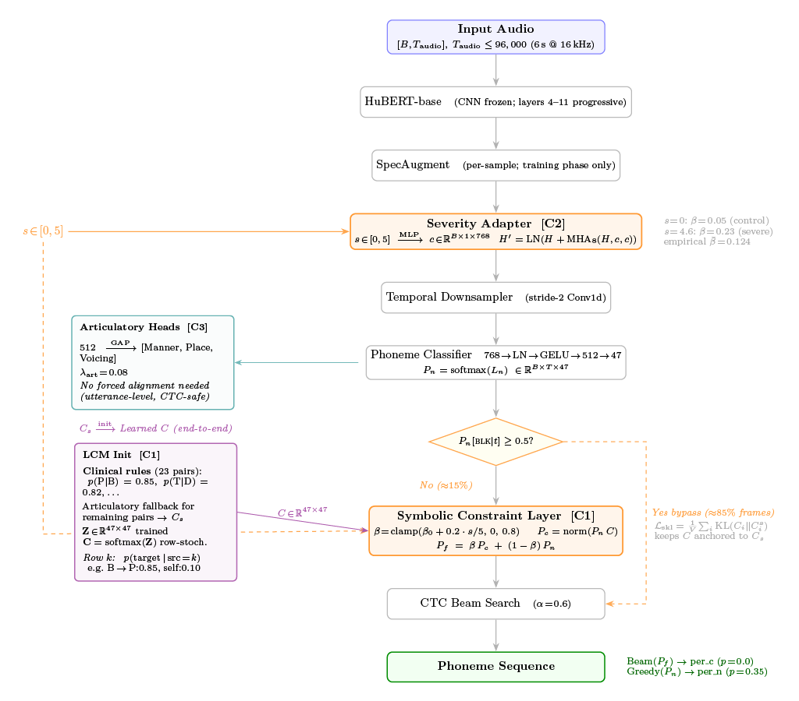

# DysarthriaNSR — Neuro-Symbolic ASR for Dysarthric Speech

This repository builds and evaluates a clinically interpretable neuro-symbolic automatic speech recognition system for dysarthric speech using TORGO.

**Target venue:** SPCOM 2026 | **Status:** LOSO-CV complete (15/15 folds) | **License:** MIT

> **LOSO macro PER · 0.2848** (95% CI: [0.1921, 0.3801])
> **LOSO weighted PER · 0.2299**
> **Folds complete · 15/15**

---

## What This Is

Dysarthria is a motor speech disorder — caused by conditions such as cerebral palsy and ALS — that produces severely reduced intelligibility due to impaired articulatory control. Commercial ASR systems fail for dysarthric speakers because they treat atypical phoneme realizations as noise. DysarthriaNSR addresses this by combining a pretrained HuBERT encoder (`facebook/hubert-base-ls960`) with three jointly-trained neuro-symbolic components.

The **`LearnableConstraintMatrix`** (Proposal P2) is a |V|×|V| differentiable phoneme confusion matrix (47×47 on the current TORGO vocabulary) initialized from articulatory priors — for example, the devoicing tendency B→P or the liquid gliding tendency R→W — and trained end-to-end while a symbolic KL anchor (λ=0.5) prevents arbitrary drift. The **`SeverityAdapter`** (Proposal P3) injects a continuous severity score [0, 5] into HuBERT hidden states via cross-attention, allowing a single model to condition behavior across the full spectrum from control speakers (severity=0.0) to severely dysarthric speakers (severity=4.9). The **`SymbolicConstraintLayer`** fuses neural posteriors with the learned constraint using a severity-adaptive blend weight β = clamp(β_base + 0.2·severity/5, 0.0, 0.8), bypassing the constraint entirely for blank-dominant CTC frames (P_neural\[blank\] ≥ 0.5) to avoid amplifying blank posteriors across ~85% of frames. Training uses six simultaneous loss terms including blank-prior KL regularization to suppress CTC insertion bias. The result is a system providing clinically interpretable phoneme-level error analysis alongside recognition output.

## Final system figure



Figure highlights:
- SpecAugment is applied before SeverityAdapter (training-only, per-sample masking).
- Severity-conditioned fusion uses β with base `0.05` and slope `0.2` over severity `s∈[0,5]`.
- Symbolic constraints are bypassed on blank-dominant frames (about 85%), and C is KL-anchored to the clinical prior.

---

## Key Results

| Model | Macro PER | Weighted PER | Single-split PER | Notes |
|---|---|---|---|---|---|
| `loso_v1` (full system, LOSO) | **0.2848** (95% CI: [0.1921, 0.3801]) | **0.2299** | — | Publication result, 15/15 folds |
| `v4_final` (full system, v0.6.0) | **0.137** (95% CI: [0.081, 0.208]) | 0.140 | 0.137 | **Paper result** (beam width 25; per_neural=0.1368 beam) |
| `ablation_neural_only_v7` | **0.1346** | — | 0.1346 | Neural-only ablation |
| `baseline_v6` (full system) | 0.1372 | — | 0.1372 | per_constrained; earlier reference |
| `ablation_no_constraint_matrix_v6` | 0.1444 | — | 0.1444 | SeverityAdapter only |
| `v4_final_beta_high` (β base=0.3, slope=1.5) | **0.378** (95% CI: [0.122, 0.804]) | 0.305 | — | Constraint dominating at inference (+181% vs neural-only) |

**Symbolic constraint update (v0.6.0):** The full system (`v4_final`) achieves **0.137 macro-speaker PER** (beam search, width 25) with **0.120 WER** and **1.9× I/D ratio** on the held-out test set (3,548 utterances). **Decoder confounding resolved:** with both paths decoded with beam search (width 25), the neural backbone achieves 0.1368 vs constrained 0.1372 — Δ = +0.00028 (p=0.025, significant but practically zero). The previously reported +0.003 gap was ~90% an artifact of comparing neural (greedy) vs constrained (beam). The constraint's inference-time fusion has negligible frame-level effect (99.7% neutral, 27.9% pass rate) because β is small (0.05–0.23) and the KL-regularized constraint matrix is near-identity.

**The constraint's true benefit is as a training-time regularizer:** it prevents the SeverityAdapter from degrading accuracy. The ablation chain tells the story — SeverityAdapter alone raises PER to 0.1444 (+7.3% vs neural-only), and adding the constraint recovers 73% of that loss, back to 0.1372. Removing the constraint matrix while keeping the adapter yields a model that is **worse than** the full system. **A controlled diagnostic using higher β** (base=0.3, slope=1.5; M03 β=0.8 vs default 0.23) confirms the constraint matrix is not useful as an inference-time fusion component — dysarthric PER collapses from 0.081 to 0.804, demonstrating that the constraint must remain weak at inference and that its true contribution is in regularizing the joint training. This, combined with clinical interpretability (per-phoneme confusion, articulatory breakdown: manner=80.5%, place=90.4%, voice=95.8%), justifies the neuro-symbolic design. Dysarthric-stratified LOSO interpretation remains the decisive analysis for SPCOM positioning.

Single-split results are computed on approximately 2 test speakers and are not publication-valid statistics. All single-split figures are development references only.

---

## Quick Start

### Installation

```bash
git clone https://github.com/Nidszxh/DysarthriaNSR.git
cd DysarthriaNSR
python -m venv .venv && source .venv/bin/activate
pip install -r requirements.txt
python -c "import nltk; nltk.download('averaged_perceptron_tagger_eng')"

# Optional: pre-download HuBERT (~360 MB)
python -c "
from transformers import HubertModel
HubertModel.from_pretrained(
    'facebook/hubert-base-ls960',
    revision='dba3bb02fda4248b6e082697eee756de8fe8aa8a'
)
print('HuBERT ready')
"
```

### Dataset Setup

```bash
# Step 1: Download TORGO audio from HuggingFace (abnerh/TORGO-database)
python src/data/download.py

# Step 2: Generate manifest with G2P + articulatory labels (~16,531 rows)
python src/data/manifest.py
```

### Run Commands

```bash
# Best single-split training + evaluation (v0.6.0 fixes, ties neural-only)
python run_pipeline.py --run-name v4_final

# Full evaluation with beam search, explainability, uncertainty & temperature calibration
python run_pipeline.py --run-name v4_final --skip-train \
    --beam-search --beam-width 25 --explain --uncertainty \
    --uncertainty-samples 20 --calibrate-temperature

# Neural-only ablation (bypasses SeverityAdapter + SymbolicConstraintLayer)
python run_pipeline.py --run-name ablation_neural_only_v7 --ablation neural_only

# Full system baseline (earlier reference)
python run_pipeline.py --run-name baseline_v6

# Full LOSO cross-validation (~32h on RTX 4060; this produces the publication result)
python run_pipeline.py --run-name loso_v1 --loso

# Resume LOSO from last completed fold (crash-safe)
python run_pipeline.py --run-name loso_v1 --loso --resume-loso

# Smoke test: unit profile (8 checks, fast)
python scripts/smoke_test.py --profile unit
```

---

## Repository Layout

```
DysarthriaNSR/
├── run_pipeline.py          # Canonical entry point: train + eval orchestrator
├── train.py                 # DysarthriaASRLightning, run_loso()
├── evaluate.py              # evaluate_model(), BeamSearchDecoder, compute_per()
├── requirements.txt         # Pinned dependency stack
├── src/
│   ├── models/
│   │   ├── model.py         # NeuroSymbolicASR, all architectural components
│   │   ├── losses.py        # OrdinalContrastiveLoss, BlankPriorKLLoss, SymbolicKLLoss
│   │   └── uncertainty.py   # UncertaintyAwareDecoder (MC-Dropout)
│   ├── data/
│   │   ├── dataloader.py    # TorgoNeuroSymbolicDataset, NeuroSymbolicCollator
│   │   ├── manifest.py      # TORGO manifest generation (G2P → ARPABET)
│   │   └── download.py      # Audio download from HuggingFace
│   ├── utils/
│   │   ├── config.py        # All hyperparameters — single source of truth
│   │   ├── constants.py     # Shared phoneme articulatory constants
│   │   └── sequence_utils.py # align_labels_to_logits()
│   └── explainability/      # PhonemeAttributor, SymbolicRuleTracker, formatters
├── scripts/
│   ├── smoke_test.py        # Profiles: unit (8 checks), pipeline (CLI integration)
│   └── generate_figures.py  # Publication-quality figure CLI
├── docs/                    # User-facing documentation
├── data/raw/audio/          # Downloaded TORGO .wav files (gitignored)
├── data/processed/          # Manifest CSV + feature_cache/ (gitignored)
├── checkpoints/             # Per-run model checkpoints (gitignored)
└── results/                 # Per-run evaluation artifacts + figures (gitignored)
```

---

## Documentation Index

| File | Description |
|---|---|
| [docs/architecture.md](docs/architecture.md) | Complete model reference: forward pass diagram, all 7 components, ablation modes, freeze schedule, multi-task loss |
| [docs/experiments.md](docs/experiments.md) | Reproducible record of all experiments, LOSO results, ablation analysis, known limitations, reproduction commands |
| [docs/data.md](docs/data.md) | TORGO corpus, download/manifest pipeline, manifest schema, vocabulary system, collator internals, data splits |
| [docs/training.md](docs/training.md) | Environment setup, configuration system, complete CLI reference, training dynamics, monitoring, troubleshooting |
| [docs/evaluation.md](docs/evaluation.md) | Metrics reference, greedy and beam decoders, symbolic impact analysis, explainability pipeline, uncertainty estimation |
| [docs/contributing.md](docs/contributing.md) | Code conventions, adding components/metrics/ablations, fix naming, known codebase risks |

---

## Hardware Requirements

RTX 4060 8GB (CUDA 12.x), 16 GB CPU RAM, 50 GB free storage. BF16 mixed precision (`bf16-mixed`) is the default; use `16-mixed` for pre-Ampere GPUs.

---

## Citation

```bibtex
@inproceedings{dysarthriaNSR2026,
  title     = {Neuro-Symbolic Phoneme Recognition for Dysarthric Speech with
               Articulatory Constraints and Severity-Adaptive Fusion},
  author    = {},
  booktitle = {Proceedings of SPCOM 2026},
  year      = {2026},
}

@article{rudzicz2012torgo,
  title     = {The TORGO database of acoustic and articulatory speech from speakers with dysarthria},
  author    = {Rudzicz, Frank and Namasivayam, Aravind Kumar and Bhasha, Tom},
  journal   = {Language Resources and Evaluation},
  volume    = {46},
  number    = {4},
  pages     = {523--541},
  year      = {2012},
  publisher = {Springer}
}
```

---

## License

This project is released under the [MIT License](LICENSE). Copyright (c) 2026 Nidish SR.
