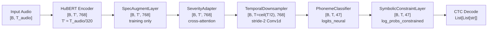

# docs/architecture.md — Model Architecture

> Cross-references: [docs/experiments.md](experiments.md) for ablation results, [docs/data.md](data.md) for vocabulary and tensor shapes entering the model.

---

## System Overview

### Tensor Shape Table

| Stage | Tensor | Shape | Notes |
|---|---|---|---|
| Audio input | `input_values` | [B, T_audio] | T_audio ≤ 96,000 (6.0s @ 16 kHz) |
| HuBERT output | `last_hidden_state` | [B, T', 768] | T' ≈ T_audio / 320 (~50 Hz) |
| After SpecAugment | `hidden_states` | [B, T', 768] | Training only; shapes unchanged |
| After SeverityAdapter | `hidden_states` | [B, T', 768] | Cross-attention residual |
| After TemporalDownsampler | `hidden_states` | [B, T, 768] | T = (T' + 1) // 2 (~25 Hz) |
| PhonemeClassifier shared features | `shared_features` | [B, T, 512] | Pre-classifier hidden dim |
| PhonemeClassifier output | `logits_neural` | [B, T, 47] | Raw logits, V=47 |
| Articulatory heads (pooled) | `logits_manner/place/voice` | [B, \|class\|] | Global average pool over time |
| Neural softmax | `P_neural` | [B, T, 47] | softmax(logits_neural) |
| Constraint matrix | `C` | [47, 47] | Row-stochastic, learnable |
| Constrained distribution | `P_constrained` | [B, T, 47] | P_neural @ C, renormalized |
| Fused final distribution | `P_final` | [B, T, 47] | β·P_constrained + (1-β)·P_neural |
| Log-probs for CTC | `log_probs_constrained` | [B, T, 47] | log(P_final.clamp_min(1e-6)) |
| CTC input | transposed | [T, B, 47] | Required by nn.CTCLoss |

---

## Components

### HuBERT Backbone

**Purpose:** Extracts contextual acoustic representations from raw waveforms using self-supervised pretraining on 960h of LibriSpeech.

**Key design decision:** The CNN feature extractor is permanently frozen (`freeze_feature_extractor=True`) because it encodes low-level acoustic features that do not benefit from dysarthric fine-tuning. Upper transformer layers are progressively unfrozen using a three-stage schedule to balance VRAM constraints against adaptation quality.

**Class/file:** `HubertModel` from `transformers` (`facebook/hubert-base-ls960`, revision `dba3bb02fda4248b6e082697eee756de8fe8aa8a`), instantiated in `NeuroSymbolicASR.__init__()` (`src/models/model.py` L707).

| Parameter | Default | Description |
|---|---|---|
| `hubert_model_id` | `facebook/hubert-base-ls960` | HuBERT checkpoint ID |
| `hubert_model_revision` | `dba3bb02fda4248b6e082697eee756de8fe8aa8a` | Pinned hub revision for reproducibility |
| `freeze_feature_extractor` | `True` | CNN always frozen |
| `freeze_encoder_layers` | `[0, 1, 2, 3]` | Permanently frozen transformer layers |
| `use_gradient_checkpointing` | `True` | Reduces VRAM ~15–25% at ~10% speed cost |

---

### SeverityAdapter

**Purpose:** Injects a continuous severity signal [0, 5] into HuBERT hidden states via cross-attention, providing spatially-aware, frame-level dysarthria conditioning.

**Key design decision:** Cross-attention (rather than a scalar bias) allows the adapter to selectively amplify or suppress dysarthria-relevant acoustic features at each time step. Control speakers (severity=0) receive a learned constant offset from the bias terms — the adapter is informative for both populations, unlike a pure gating mechanism.

**Class/file:** `SeverityAdapter` in `src/models/model.py` L432.

| Parameter | Default | Description |
|---|---|---|
| `use_severity_adapter` | `True` | Enable/disable adapter |
| `severity_adapter_dim` | `64` | Bottleneck dim for severity projection |
| `hidden_dim` | `768` | Matches HuBERT output dim |
| `n_heads` | `8` | Multi-head attention heads |
| `classifier_dropout` | `0.1` | Dropout on attention output |

---

### SpecAugmentLayer

**Purpose:** Applies independent time and frequency masks to HuBERT hidden states during training to prevent overfitting on the small TORGO dataset.

**Key design decision:** Masks are applied per-sample independently (B13 fix — batch-uniform masking was the original bug). SpecAugment is placed before `SeverityAdapter` to avoid masking the severity conditioning signal.

**Class/file:** `SpecAugmentLayer` in `src/models/model.py` L503.

| Parameter | Default | Description |
|---|---|---|
| `use_spec_augment` | `True` | Enable/disable |
| `spec_time_mask_prob` | `0.05` | Expected fraction of time steps to mask |
| `spec_time_mask_length` | `10` | Max consecutive frames per mask |
| `spec_freq_mask_prob` | `0.05` | Expected fraction of feature dims to mask |
| `spec_freq_mask_length` | `8` | Max consecutive dims per mask |

---

### TemporalDownsampler

**Purpose:** Halves the frame rate from ~50 Hz to ~25 Hz using a stride-2 Conv1d, forcing the model to aggregate context from neighboring frames before predicting phonemes.

**Key design decision:** Dysarthric speech has elongated, slurred phonemes spanning many frames. With a mostly-frozen encoder, direct per-frame prediction is unstable. Stride-2 downsampling makes CTC alignment substantially more robust and is the primary reason `output_lengths` must be adjusted: `output_lengths = (output_lengths + 1) // 2`.

**Class/file:** `TemporalDownsampler` in `src/models/model.py` L580.

| Parameter | Default | Description |
|---|---|---|
| `use_temporal_downsample` | `True` | Enable/disable |
| `hidden_dim` | `768` | Input/output channels |
| `classifier_dropout` | `0.1` | Post-activation dropout |

---

### PhonemeClassifier

**Purpose:** Maps HuBERT hidden states to phoneme logits and articulatory class logits via a two-layer MLP.

**Key design decision:** Articulatory auxiliary heads (manner, place, voice) use global average pooling over time before classification. This avoids the frame-CE alignment problem — CTC provides no forced alignment, so frame-level articulatory supervision is meaningless. Utterance-level mode labels are used as supervision targets (I5 fix).

**Class/file:** `PhonemeClassifier` in `src/models/model.py` L634.

| Parameter | Default | Description |
|---|---|---|
| `hidden_dim` | `512` | Projection bottleneck width |
| `classifier_dropout` | `0.1` | Dropout between layers |
| `num_phonemes` | `47` (runtime) | Set to `len(phn_to_id)` at init |

---

### LearnableConstraintMatrix

**Purpose:** An end-to-end trainable phoneme confusion matrix initialized from articulatory priors and anchored by `SymbolicKLLoss` to prevent arbitrary drift.

**Key design decision:** Plain `log(C_static)` passed through softmax produces a flat distribution (softmax renormalizes). Temperature-sharpened initialization (`logit_C = log(C_static + ε) / 0.5`) preserves the diagonal peakedness of the prior at epoch 0 (B21 fix). The `SymbolicKLLoss` with λ=0.5 prevents the learned matrix from drifting toward blank-dominated rows.

**Class/file:** `LearnableConstraintMatrix` in `src/models/model.py` L138.

| Parameter | Default | Description |
|---|---|---|
| `use_learnable_constraint` | `True` | Enable learnable vs. static matrix |
| `init_temperature` | `0.5` | Temperature for sharpened initialization |
| `lambda_symbolic_kl` | `0.5` | KL anchor loss weight (raised from 0.05, B22) |

---

### SymbolicConstraintLayer

**Purpose:** Fuses neural phoneme posteriors with phonologically-motivated priors in a severity-adaptive manner, producing the final log-probabilities passed to CTC.

**Key design decision:** Blank-frame masking bypasses the constraint for frames where `P_neural[blank] >= 0.5`. Approximately 85% of CTC frames are blank-dominant; applying the constraint matrix to those frames amplifies blank posteriors and degrades PER. The adaptive β formula is `β = clamp(β_base + 0.2 * severity/5, 0, 0.8)`, making control speakers use β≈0.05 and severe dysarthric speakers use β≈0.25.

**Class/file:** `SymbolicConstraintLayer` in `src/models/model.py` L188.

| Parameter | Default | Description |
|---|---|---|
| `constraint_weight_init` | `0.05` | Initial β (learnable, clamped <0.8) |
| `severity_beta_slope` | `0.2` | Rate of β increase per normalized severity unit |
| `blank_constraint_threshold` | `0.5` | Blank-dominance gate threshold |
| `min_rule_confidence` | `0.05` | Minimum β for rule activation logging (C5 fix) |

---

## Ablation Modes

Controlled via `--ablation` flag (maps to `ModelConfig.ablation_mode` / `TrainingConfig.ablation_mode`):

| Mode | SeverityAdapter | SymbolicConstraintLayer | ArtHeads | Notes |
|---|---|---|---|---|
| `full` | ✅ | ✅ learnable C | ✅ | Default production mode |
| `neural_only` | ❌ | ❌ bypassed entirely | ❌ | Pure HuBERT+classifier; **best single-split PER (0.1346)** |
| `no_constraint_matrix` | ✅ | ❌ log-softmax of neural logits | ✅ | Tests SeverityAdapter contribution in isolation |
| `no_art_heads` | ✅ | ✅ | ❌ | Tests articulatory head contribution |
| `no_spec_augment` | ✅ (no aug) | ✅ | ✅ | Tests SpecAugment contribution |
| `no_temporal_ds` | ✅ (no DS) | ✅ | ✅ | Tests TemporalDownsampler contribution |
| `symbolic_only` | ✅ | ✅ | ✅ | CTC/CE disabled (λ=0); tests pure symbolic signal |

**Note:** `neural_only` achieves the best single-split PER (0.1346) across all evaluated configurations. See [docs/experiments.md](experiments.md) for full analysis.

---

## Freeze Schedule

Three-stage progressive unfreezing is implemented in `DysarthriaASRLightning.on_train_epoch_start()` in `train.py` L566.

| Stage | Epoch trigger | Layers unfrozen | Code reference |
|---|---|---|---|
| Warmup | 0 | None (entire encoder frozen) | `model.freeze_encoder()` at init |
| Stage 1 | ≥ `encoder_warmup_epochs` (default 1) | 8, 9, 10, 11 | `train.py` L590 |
| Stage 2 | ≥ `encoder_second_unfreeze_epoch` (default 6) | 6, 7, 8, 9, 10, 11 | `train.py` L601 |
| Stage 3 | ≥ `encoder_third_unfreeze_epoch` (default 12) | 4, 5, 6, 7, 8, 9, 10, 11 | `train.py` L610 |

Layers 0–3 remain frozen throughout training. After each unfreeze event, `_reset_hubert_lr_warmup()` clears Adam first/second moment estimates for the newly active parameters (T-04 fix). This is a partial fix: OneCycleLR's step counter is not reset, so newly unfrozen layers enter at the current (potentially decayed) LR position rather than at the original peak. **Resume-safe epoch logic:** the `resume_epoch_offset` attribute on the Lightning module ensures that resumed folds immediately enter the correct freeze stage without a one-epoch lag.

---

## Multi-Task Loss

Total loss formula: `loss = λ_ctc·CTC + λ_ce·CE + λ_art·Art + λ_ord·Ordinal + λ_bkl·BlankKL + λ_skl·SymKL`

| Loss | Formula | λ (current) | File | Notes |
|---|---|---|---|---|
| `CTCLoss` | CTC(log_probs_constrained, labels) | 0.80 | `train.py` | `zero_infinity=True`; uses exact `output_lengths` from model |
| Frame-CE | CrossEntropyLoss(logits_neural, aligned_labels) | **0.10** | `train.py` | Applied to neural logits, not constrained (C1 fix); reduced from 0.35 (C-1 fix) |
| Articulatory CE | (CE(manner)+CE(place)+CE(voice))/3 | 0.08 | `train.py` | Utterance-level via GAP (I5 fix) |
| `OrdinalContrastiveLoss` | Pairwise cosine hinge with ordinal margin | 0.05 | `src/models/losses.py` | Continuous TORGO severity scores |
| `BlankPriorKLLoss` | KL(Bernoulli(p̄_blank) ∥ Bernoulli(0.75)) | staged 0.10→0.15→0.20 | `src/models/losses.py` | Staged warmup schedule (I2); target prob = 0.75 |
| `SymbolicKLLoss` | KL(C_learned ∥ C_static) / V | 0.50 | `src/models/losses.py` | Anchors C to symbolic prior; raised from 0.05 (B22) |

**Staged `lambda_blank_kl` warmup schedule (I2):**
- Epochs 0–9: λ_bkl = 0.10 (gentle push)
- Epochs 10–19: λ_bkl = 0.15 (moderate push)
- Epochs ≥ 20: λ_bkl = 0.20 (full target)

---

## Training Configuration Reference

All parameters are defined in `src/utils/config.py`. Grouped by dataclass.

### `ModelConfig`

| Parameter | Default | Description |
|---|---|---|
| `hubert_model_id` | `facebook/hubert-base-ls960` | HuBERT variant |
| `hubert_model_revision` | `dba3bb02fda4248b6e082697eee756de8fe8aa8a` | Pinned hub revision |
| `freeze_feature_extractor` | `True` | CNN always frozen |
| `use_gradient_checkpointing` | `True` | Reduces VRAM ~15–25% |
| `freeze_encoder_layers` | `[0, 1, 2, 3]` | Permanently frozen transformer layers |
| `hidden_dim` | `512` | PhonemeClassifier hidden size |
| `num_phonemes` | `47` | Runtime vocab size (44 ARPABET + 3 special) |
| `classifier_dropout` | `0.1` | Dropout in classifier and adapter |
| `constraint_weight_init` | `0.05` | Initial β for symbolic blending |
| `constraint_learnable` | `True` | Enable learnable β parameter |
| `use_articulatory_distance` | `True` | Use articulatory distance for C_static fallback |
| `use_learnable_constraint` | `True` | Enable `LearnableConstraintMatrix` |
| `use_severity_adapter` | `True` | Enable cross-attention `SeverityAdapter` |
| `severity_adapter_dim` | `64` | Severity projection bottleneck |
| `use_temporal_downsample` | `True` | Enable stride-2 Conv1d downsampler |
| `use_spec_augment` | `True` | Enable SpecAugment on hidden states |
| `spec_time_mask_prob` | `0.05` | Fraction of frames to mask |
| `spec_time_mask_length` | `10` | Max consecutive frames per time mask |
| `spec_freq_mask_prob` | `0.05` | Fraction of feature dims to mask |
| `spec_freq_mask_length` | `8` | Max consecutive dims per freq mask |

### `TrainingConfig`

| Parameter | Default | Description |
|---|---|---|
| `precision` | `bf16-mixed` | BF16 on Ada GPUs; auto-falls back to 16-mixed |
| `learning_rate` | `3e-5` | Peak LR for classifier/adapter group |
| `weight_decay` | `0.01` | AdamW weight decay |
| `optimizer` | `AdamW` | Optimizer type |
| `lr_scheduler` | `onecycle` | OneCycleLR with cosine annealing |
| `warmup_ratio` | `0.05` | Fraction of total steps for LR warmup |
| `batch_size` | `12` | Per-GPU batch size |
| `gradient_accumulation_steps` | `3` | Effective batch = 12 × 3 = 36 |
| `max_epochs` | `40` | Maximum training epochs |
| `encoder_warmup_epochs` | `1` | Stage 1 unfreeze trigger epoch |
| `encoder_second_unfreeze_epoch` | `6` | Stage 2 unfreeze trigger epoch |
| `encoder_third_unfreeze_epoch` | `12` | Stage 3 unfreeze trigger epoch |
| `val_check_interval` | `1.0` | Validate once per epoch |
| `check_val_every_n_epoch` | `1` | Evaluate every N epochs |
| `num_sanity_val_steps` | `0` | Skip startup sanity validation |
| `dropout` | `0.1` | General dropout rate |
| `label_smoothing` | `0.1` | CE loss label smoothing |
| `gradient_clip_val` | `1.0` | Gradient norm clipping |
| `lambda_ctc` | `0.8` | CTC loss weight |
| `lambda_ce` | `0.10` | Frame-CE loss weight |
| `lambda_articulatory` | `0.08` | Articulatory CE weight |
| `lambda_ordinal` | `0.05` | Ordinal contrastive weight |
| `lambda_blank_kl` | `0.20` | Blank-prior KL weight (final stage) |
| `blank_target_prob` | `0.75` | Target mean blank probability |
| `blank_kl_stage1_end` | `10` | Epoch at which stage 1 KL warmup ends |
| `blank_kl_stage1_value` | `0.10` | λ_blank_kl during epochs 0–9 |
| `blank_kl_stage2_end` | `20` | Epoch at which stage 2 KL warmup ends |
| `blank_kl_stage2_value` | `0.15` | λ_blank_kl during epochs 10–19 |
| `lambda_symbolic_kl` | `0.50` | Symbolic KL anchor weight |
| `monitor_metric` | `val/per` | Checkpoint monitoring metric |
| `monitor_mode` | `min` | Lower is better |
| `early_stopping_patience` | `8` | Epochs without improvement before stopping |
| `beam_length_norm_alpha` | `0.6` | Beam search length normalization exponent |
| `beam_lm_weight` | `0.0` | Bigram LM shallow-fusion weight (0.0 = disabled) |
| `save_top_k` | `2` | Number of best checkpoints to keep |
| `num_workers` | `8` | DataLoader worker count |
| `pin_memory` | `True` | Pin tensors to page-locked memory |
| `prefetch_factor` | `4` | DataLoader prefetch queue depth |
| `blank_priority_weight` | `1.0` | Blank class weight multiplier |
| `use_loso` | `False` | Enable LOSO-CV mode |
| `loso_bootstrap_samples` | `2000` | Bootstrap iterations for LOSO CI |
| `ablation_mode` | `full` | Active ablation mode |